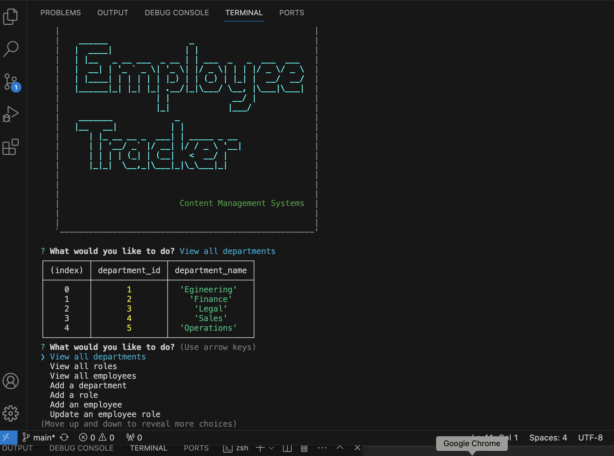

# SQL: Employee Tracker

## About this application:

This is a command-line application that allows managing a company's employee database, using Node.js, Inquirer, and MySQL.
This interface is called **content management systems (CMS)**.

Here is a [walkthrough video](https://drive.google.com/file/d/1cGd96hWPAh032174f6nhyBxjUal8-dR7/view) that demonstrates functionality of the application.

## User Story

```md
AS A business owner
I WANT to be able to view and manage the departments, roles, and employees in my company
SO THAT I can organize and plan my business
```

## Acceptance Criteria

```md
GIVEN a command-line application that accepts user input
WHEN I start the application
THEN I am presented with the following options: view all departments, view all roles, view all employees, add a department, add a role, add an employee, and update an employee role
WHEN I choose to view all departments
THEN I am presented with a formatted table showing department names and department ids
WHEN I choose to view all roles
THEN I am presented with the job title, role id, the department that role belongs to, and the salary for that role
WHEN I choose to view all employees
THEN I am presented with a formatted table showing employee data, including employee ids, first names, last names, job titles, departments, salaries, and managers that the employees report to
WHEN I choose to add a department
THEN I am prompted to enter the name of the department and that department is added to the database
WHEN I choose to add a role
THEN I am prompted to enter the name, salary, and department for the role and that role is added to the database
WHEN I choose to add an employee
THEN I am prompted to enter the employee’s first name, last name, role, and manager, and that employee is added to the database
WHEN I choose to update an employee role
THEN I am prompted to select an employee to update and their new role and this information is updated in the database
```

## Screentshot



## Installation

- Install Node.js (if you do not have one). Refer to [the website](https://nodejs.org/en) for installation guide
- Run in your terminal `npm i`
- Create .env file and specify your credentials for mySQL. Refer to .env.EXAMPLE file
- Run in your terminal `mysql -u root -p` and enter your MySQL password
- Next run the following two commands in the terminal:
  `source schema.sql` and `source seeds.sql`
  This will create employee_db database and seed the database with some data.

## Usage

- To invoke the application type in your terminal:
  `node index.js`
- Follow the prompts as desired
- To exit, simply select QUIT choice
